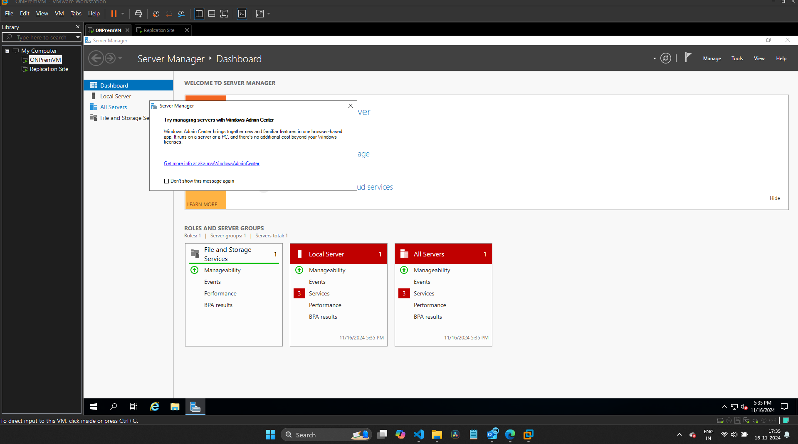

# VM Migration Lab 10 Report

## Overview

In this lab, the task was to set up a virtualized environment using VMware Workstation, install and configure a Windows Server OS, deploy a basic "Hello World" web application, and migrate the virtual machine (VM) to Azure using Azure Migrate. Post-migration, we validated the application functionality and performed a failover test to ensure resilience.

## Table of Contents

1. [Milestone 1: Environment Setup](#milestone-1-environment-setup)
2. [Milestone 2: OS Installation](#milestone-2-os-installation)
3. [Milestone 3: Application Deployment](#milestone-3-application-deployment)
4. [Milestone 4: Migration Assessment](#milestone-4-migration-assessment)
5. [Milestone 5: VM Migration Execution](#milestone-5-vm-migration-execution)
6. [Milestone 6: Validation and Failover Testing](#milestone-6-validation-and-failover-testing)
7. [Conclusion and Reflection](#conclusion-and-reflection)

---

## Milestone 1: Environment Setup

### Task: Install VMware Workstation and Create a New VM

The first step in the lab was to set up VMware Workstation, which allows you to run virtualized environments on a local machine. This was followed by the creation of a new virtual machine (VM).

**Steps:**
1. Download VMware Workstation from the official website.
2. Install VMware Workstation on the local machine.
3. Open VMware Workstation and create a new virtual machine, specifying the hardware settings such as CPU, RAM, and disk size. We configured the VM with 2 GB of RAM and 60 GB of storage.

**Expected Outcome:**  
A fully configured VMware Workstation with a new virtual machine ready for the installation of the operating system.

---

## Milestone 2: OS Installation

### Task: Install Windows Server OS on the VM

After setting up VMware, the next step was to install the Windows Server OS on the VM.

**Steps:**
1. Select the Windows Server ISO file to the virtual machine option.

3. Configure the network settings, and set up administrator credentials after the installation completes.

**Expected Outcome:**  
A Windows Server instance running on the VM with initial configurations such as networking and user setup completed.

  
*VM Workstation with Two Virtual Machines Configured*

---

## Milestone 3: Application Deployment

### Task: Deploy a “Hello World” Web Application on the Windows Server

Once the Windows Server OS was installed,deployed a simple "Hello World" web application to verify that the VM was functioning correctly and could serve web content.

**Steps:**
1. Install IIS (Internet Information Services) via the "Add Roles and Features" wizard.
2. Create a simple HTML file with the text "Hello World" and save it in the IIS root directory (`C:\inetpub\wwwroot`).
3. Open a web browser within the VM and access `http://localhost/` to confirm the application was deployed successfully.

**Expected Outcome:**  
The "Hello World" web page should be accessible via the internal network of the VM.

  
*Azure Migrate Installation in the On-Prem VM*

---

## Milestone 4: Migration Assessment

### Task: Use Azure Migrate to Perform an Assessment of the VM

Azure Migrate was used to assess the readiness of the VM for migration to Azure. This tool evaluates the compatibility of on-prem virtual machines with Azure, identifying potential issues and recommendations.

**Steps:**
1. Install the Azure Migrate appliance on the on-prem VM.
2. Set up the discovery process by connecting the on-prem environment to Azure Migrate.
3. Initiate the assessment process, selecting the VM to assess.

**Expected Outcome:**  
A migration readiness assessment report that provides compatibility results, highlighting any issues that might require attention before migration.

  
*Connectivity to Azure for Migration Assessment*

### Task: Discovery of Sources

The next step was to discover the on-prem VM that would be migrated to Azure.

**Steps:**
1. In Azure Migrate, configure the discovery of the on-prem VMs by linking your VMware environment.
2. Run the discovery process to identify the VMs available for migration.

**Expected Outcome:**  
A list of discovered VMs that are ready for migration to Azure.

  
*Discovery Sources for Migration Process*

---

## Milestone 5: VM Migration Execution

### Task: Replicate the Discovered VM

The next phase of the lab involved replicating the on-prem VM to Azure using Azure Site Recovery (ASR). This ensures that the VM can be migrated safely to Azure.

**Steps:**
1. Install the Azure Site Recovery (ASR) agent on the on-prem VM.
2. Set up replication to start the process of copying the VM data to Azure.
3. Configure replication settings, including network and storage settings for the VM in Azure.

**Expected Outcome:**  
The VM will begin replicating to Azure, with the settings configured for migration.

  
*Download and Install Application in the Replication VM*

### Task: Execute Initial Migration Phase

With replication complete, the initial migration phase was started.

**Steps:**
1. Start the migration process in Azure Migrate, selecting the replicated VM.
2. Monitor the migration progress to ensure no issues occur during the process.

**Expected Outcome:**  
The VM is successfully migrated to Azure, with all necessary settings applied.

  
*Initial Migration Phase from On-Prem to Azure*

---

## Milestone 6: Validation and Failover Testing

### Task: Validate the Migrated VM's Functionality

Once the migration was complete, we needed to verify that the VM and the "Hello World" application were working properly in Azure.

**Steps:**
1. Use Remote Desktop Protocol (RDP) or SSH to access the migrated VM in Azure.
2. Open a browser and verify that the "Hello World" application is accessible, similar to how it was on the on-prem VM.
3. Conduct a failover test by simulating a failure in the Azure environment and ensuring the VM recovers using secondary resources.

**Expected Outcome:**  
The migrated VM should function properly, and the application should remain accessible after failover.

  
*Migrated VM on Azure Post-Migration*

---

## Conclusion and Reflection

### Reflection on the Migration Process

The migration process was relatively smooth, but there were challenges such as ensuring compatibility between the on-prem environment and Azure. The Azure Migrate tool provided an insightful assessment, identifying key areas that required attention, such as network configurations and storage options. The replication process was straightforward, but the failover test proved essential in verifying the VM's resilience in a cloud environment.

The entire process demonstrated the importance of thorough testing, both before and after migration, to ensure minimal downtime and ensure business continuity.

  
*RDP and SSH Port Configurations on NSG*

---

## Deliverables

### Assessment Report

A detailed summary of the Azure Migrate assessment, including any compatibility issues and recommended fixes.

### Migration Outcome

A log of the migration process, including any errors encountered and their resolutions.

### Validation Results

Screenshots or a video demonstrating the "Hello World" application functioning in Azure post-migration.

### Reflection

A brief analysis of the migration process, challenges faced, and lessons learned.

---

This README serves as the complete report for the VMware to Azure migration lab. All images referenced in this report can be found in the `images/` folder. Each image is numbered and described to ensure clarity. The process was completed step-by-step, ensuring a smooth and successful migration from VMware Workstation to Azure.